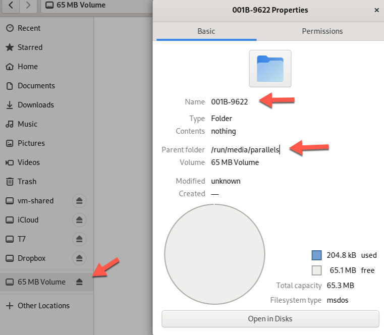

# PREPARATION 2-2 Preparing the USB Thumb Drive


3. Use the dmesg command to determine which device file the kernel has assigned to the USB drive. it will probably be something like /dev/sdb. The dmesg output should show at least one partition /dev/sdb1. The drive letter – b in this example – may be a different letter on your Linux computer.

```
parallels@fedora ~]$ dmesg | grep '/dev\/sd'
[    4.033573] BTRFS: device label fedora_localhost-live devid 1 transid 297 /dev/sda2 scanned by systemd-udevd (368)

```

```
parallels@fedora ~]$ ls /dev/sd*
/dev/sda  /dev/sda1  /dev/sda2  /dev/sdb  /dev/sdb1

```

4. Mount the drive’s partition on /mnt.

```
parallels@fedora ~]$ sudo mount -t ext4 /dev/sda2 /mnt
mount: /mnt: /dev/sda2 already mounted on /.
       dmesg(1) may have more information after failed mount system call.
```



5. Change the pwd to /mnt.

```
[parallels@fedora 001B-9622]$ ls -a
.  ..  .fseventsd  .Trashes
[parallels@fedora 001B-9622]$ pwd
/run/media/parallels/001B-9622

```

7. Enter and run the following command to create some files with content on the drive.

```
[parallels@fedora 001B-9622]$ for I in 0 1 2 3 4 5 6 7 8 9 ; do dmesg > file$I.txt;done
```

8. Verify that there are now at least 10 files on the drive with the names file0.txt through file9.txt.

```
[parallels@fedora 001B-9622]$ for I in 0 1 2 3 4 5 6 7 8 9 ; do dmesg > file$I.txt;done
[parallels@fedora 001B-9622]$ ls -a
.  ..  file0.txt  file1.txt  file2.txt  file3.txt  file4.txt  file5.txt  file6.txt  file7.txt  file8.txt  file9.txt  .fseventsd  .Trashes

```

10. Unmount the USB drive and remove it from the computer until it is needed.


---

## Extra experiment 1:

auto mount again

```
[parallels@fedora dev]$  dmesg | grep '/dev\/sd'
[    3.955793] BTRFS: device label fedora_localhost-live devid 1 transid 360 /dev/sda2 scanned by systemd-udevd (357)
[parallels@fedora dev]$ ls /dev/sd*
/dev/sda  /dev/sda1  /dev/sda2  /dev/sdb  /dev/sdb1

```

Eject disk with the desktop, then run`dmesg | grep '/dev\/sd'` return same result, but `/dev/sdb1` is now missing:

```
[parallels@fedora dev]$  dmesg | grep '/dev\/sd'
[    3.955793] BTRFS: device label fedora_localhost-live devid 1 transid 360 /dev/sda2 scanned by systemd-udevd (357)
[parallels@fedora dev]$ ls /dev/sd*
/dev/sda  /dev/sda1  /dev/sda2  /dev/sdb
```

### Conclusion: 

So, `dmesg` does not show me which device is usb drive. Or perhaps I don't know how to use `dmesg`, but may be `dmesg` works differently in a VM.


## Extra experiment 2: 

Now that I know usb is `/dev/sdb1` let's see if I can mount it somewhere [2]:

```
$ mkdir ~/myusb
$ ls ~
Desktop  Documents  Downloads  Music  myusb  Pictures  Public  Templates  Videos

$ sudo mount /dev/sdb1 ~/myusb
$ cd ~/myusb
$ ls
foo.txt
```

It works! 

To confirm, let's check with the `mount` command [2]: 

```
$ mount | grep 'sdb1'
/dev/sdb1 on /run/media/parallels/001B-9622 type vfat (rw,nosuid,nodev,relatime,uid=1000,gid=1000,fmask=0022,dmask=0022,codepage=437,iocharset=ascii,shortname=mixed,showexec,utf8,flush,errors=remount-ro,uhelper=udisks2)
/dev/sdb1 on /home/parallels/myusb type vfat (rw,relatime,uid=1000,gid=1000,fmask=0022,dmask=0022,codepage=437,iocharset=ascii,shortname=mixed,showexec,utf8,flush,errors=remount-ro)
```

Now lets unmount `dev/sdb1` from `~/myusb`:

```
$ sudo umount ~/myusb
umount: /home/parallels/myusb: target is busy.
$ cd ~
$ sudo umount ~/myusb
$ ls 
Desktop  Documents  Downloads  Music  myusb  Pictures  Public  Templates  Videos
$ cd myusb
$ ls -a
.  ..
```


[1] https://linuxconfig.org/howto-mount-usb-drive-in-linux

[2] https://superuser.com/questions/361885/how-do-i-figure-out-which-dev-is-a-usb-flash-drive
